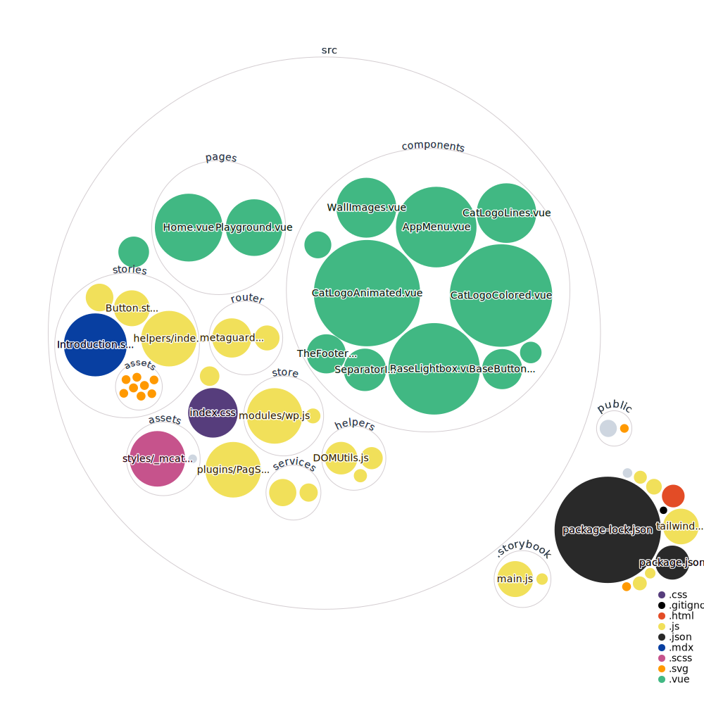

# mchat project

Mchat is a personal project allowing me to play with vite/vuejs3, tailwindcss and other cool stuff

The website use data from Monsieur Chat's official website (Wordpress), which is a French artist who makes lovely cats throughout the city.

**If you like his work, please visit [Monsieur Chat's website](https://monsieurchat.fr/)**

## Project codebase visualization

[view in the browser](https://octo-repo-visualization.vercel.app/?repo=longplayer%2Fmchat)

